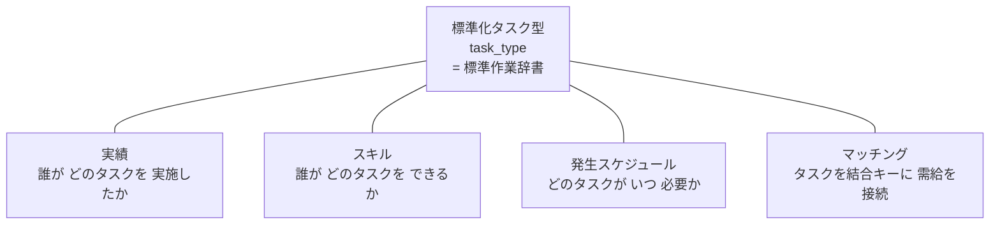
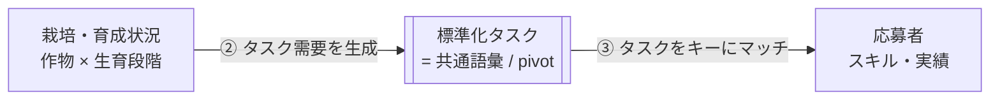
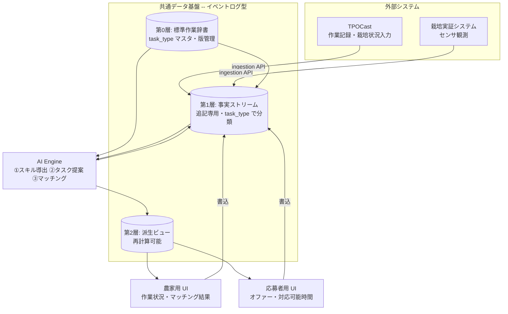
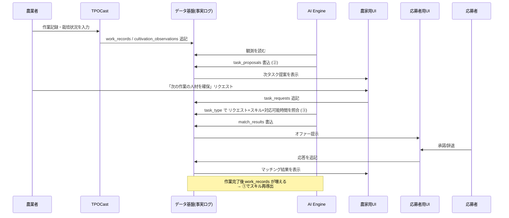

# SODAT R8 アーキテクチャ設計

> 対象: R8 研究開発計画 4.3「労働力の最適化に資するシステムの構築」
> ステータス: ドラフト（議論の起点。確定ではない）

---

## 1. 背景と位置づけ

### 1.1 現行システムと R8 SODAT は別物

本リポジトリ `sodat_control` の現状は **栽培実証システム**（センサ群 + 管理ダッシュボード）である。
R8 計画 4.3 の SODAT は **動的マッチングプラットフォーム**であり、両者は目的が異なる。

| | 現行 `sodat_control` | R8 4.3 で構築する SODAT |
|---|---|---|
| 実体 | 栽培実証システム | 労働力マッチング基盤 |
| Dashboard | センサデータ可視化 | 農家向け：作業状況＋マッチング結果 |
| 中核 | データ収集・アップロード | AI Engine（タスク⇄人材照合） |
| データ | Google Sheets | イベントログ型データ基盤 |

R8 SODAT は現行システムを置き換えるものではなく、**その上に/隣に構築**する。
栽培実証システムは「栽培・育成状況」という観測データの供給源として、TPOCast は「作業記録」の供給源として、それぞれ SODAT に接続される。

### 1.2 システムの主目的

あらかじめ登録された応募者のスキル・実績と、農業現場で短期に分解されたタスクを、
**AI を用いて動的にマッチング**する。これに加えて 2 つの仕組みを持つ:

- **① 実績→スキル自動登録**: TPOCast で作業を登録すると実績として自動蓄積され、習熟度が上がるとスキルとして登録される。
- **② 栽培状況→タスク自動提案**: 栽培・育成状況を登録すると、次に必要なタスクが「タイミング・負荷・必要人数」付きで自動提案される。

---

## 2. 設計思想: 標準化タスクを中核に据える（Task-Centric Design）

本システムの技術的コアは **標準化タスク（`task_type`）** である。
実績・スキル・発生スケジュール・マッチングは独立した概念ではなく、**すべてタスクを参照して定義される**。
タスクがハブであり、他はすべてスポークである。システム全体がタスクに従う。

### 2.1 すべてがタスクを外部キーに持つ

- **実績** = 「誰が **どのタスクを** 実施したか」
- **スキル** = 「誰が **どのタスクを** どの習熟度でできるか」（実績から導出）
- **発生スケジュール** = 「**どのタスクが** いつ・どれだけ必要か」
- **マッチング** = **タスクを結合キー**とした需給の接続

### 2.2 標準化がマッチングを「型の結合」に還元する ← 技術的核心

これが「標準化されたタスク」を**技術的**コアたらしめる理由である。

スキル（供給側）も需要（発生側）も **同じタスク語彙で表現される**ため、マッチングは
`task_type` の **自然結合（join）** になる。「この人のスキルは、この求人要件を満たすか？」という
**曖昧な対応付け層が不要**になる。求人は「タスク T が必要」、スキルは「タスク T ができる」——
同一の型 T で照合するだけ。

標準化しなければ、農場ごとにバラバラな作業記述を都度スキル要件へマッピングする層が必要になり、
そこが精度劣化と保守コストの温床になる。**標準化タスクはこのマッピング層そのものを消す。**

### 2.3 タスクは栽培ドメインと労働ドメインの接続点（pivot）

栽培実証システム（観測）と人材マッチング（労働）という 2 つの世界を、
**タスクが唯一の共通言語として繋ぐ**。センサ観測も応募者スキルも、最終的に
「タスク」という 1 つの通貨に換算される。

### 2.4 タスクには 2 種類ある（型 と 実体）

| | タスク**型**（task_type） | タスク**実体/発生**（instance） |
|---|---|---|
| 実体 | 標準作業辞書のエントリ | 特定農場・時間枠での提案/リクエスト、実施された作業 |
| 性質 | **マスタデータ**（ゆっくり変わる・版管理） | **イベント**（速く流れる・追記ログ） |
| 例 | 「キャベツ定植」という型 | 「◯農場で 5/10 にキャベツ定植を 3 人」 |

**標準作業辞書（昨年度成果: 野菜・果樹・お茶の三作目）は、単なる ② の入力ではなく、
プラットフォーム全体のスキーマ背骨**である。ログに流れる全事実はこの辞書の型で分類される。

### 2.5 含意: 粒度がシステムの解像度そのもの

- `task_type` が全体の共有キーゆえ、**辞書を変えると全派生状態に波及**する
  → 辞書は**版管理必須**、各事実は「どの辞書版で分類されたか」を記録する。
- **タスク分解の粒度 = システム全体の解像度**。粗すぎればスポットワークに分解できず、
  細かすぎれば実績が集まらない。4.3.2 の「**タスク定義の粒度・妥当性**」は、
  システムの中心変数を検証する作業として位置づける。

---

## 3. 設計原則

### 原則0: 標準化タスク中心（§2）

すべての事実は標準作業辞書の `task_type` で分類される。タスクが型システムであり結合キーである。

### 原則1: イベントログ中核（事実は追記のみ、状態は導出する）

データ基盤は **追記専用のイベントログ**を骨格とする。作業記録・栽培観測・応募・マッチング結果などの
**「起きた事実」は上書き・削除せず追記し続け**、スキルレベルやタスク提案などの状態は事実列から**計算して導出**する。

理由: ①② は両方「事実を溜める → 状態を導く」構造であり、「スキルレベル」や「タスク提案」は
入力値ではなく**事実の関数**である。これを追記ログにすることで、4.3.2 が求める
**マッチング精度の実証評価**（「なぜこの照合になったか」の再現）と**データガバナンス**（監査可能性）が成立する。

### 原則2: 2 種類のタイムスタンプ

すべての事実は 2 つの時刻を持つ:

- `event_time` — その事象が実際に起きた時刻（作業が行われた／観測が行われた時刻）
- `recorded_at` — システムに記録された時刻

`event_time` は対応可能時間の突き合わせ（マッチング）に、`recorded_at` は
「時刻 T の時点でシステムが何を知っていたか」の再現（実証評価）に必要。

### 原則3: 単一の AI Engine（3 つの導出は同じパターン）

①スキル導出・②タスク提案・③マッチングは、すべて
**「イベントログを読む → 計算する → 派生事実を書き戻す」**という同一構造。
別システムに分けず、1 つの AI Engine が 3 つの導出を担う。

### 原則4: API は外部境界のみ、内部は共有データ経由

内部 4 モジュール間を点対点 API で連携させると、連携制御そのものが肥大化する。
内部はすべて共有データ基盤を介して連携し、**モジュール間の直接 API はゼロ**。
API は **TPOCast など外部システムとの境界にのみ**置く（"APIs at the edges, shared data in the core"）。

### 原則5: 統治は単一データ層で

データの所有権・利用範囲・アクセス制御（4.3.2 の成果物）は、単一の統治されたデータ層で定義する。
N 本の点対点フローより、単一データ層のほうが桁違いに統治しやすい。

---

## 4. モジュール構成

4 モジュールはすべて共通データ基盤を介して連携し、互いを直接呼ばない。

| モジュール | 基盤から読む | 基盤へ書く | 他モジュール直接連携 |
|---|---|---|---|
| **TPOCast 連携** | `task_types` | `work_records`, `cultivation_observations` | なし（外部 API のみ） |
| **AI Engine** | `task_types`, 事実全般 | `worker_skills`, `task_proposals`, `match_results` | なし |
| **農家用 UI** | `farmer_dashboard_view`, `task_proposals` | `task_requests` | なし |
| **応募者用 UI** | `worker_dashboard_view`, `match_results` | `worker_availability`, 応募応答 | なし |

---

## 5. データ基盤設計

データ基盤は 3 層構造。**辞書（第0層）が型を定義し、事実（第1層）が唯一の真実、派生（第2層）は
再計算可能なキャッシュ**。すべての事実は `task_type_id` を参照する。

### 5.0 第0層: 標準作業辞書（マスタ・版管理）

| テーブル | 内容 | 主なカラム（案） |
|---|---|---|
| `task_types` | 標準化タスクの型定義 | task_type_id(`base.crop`), base, task_name, crop, process, spot_aptitude, qualification_note, **dictionary_version** |

タスク型は全システムの共有キー。版管理し、事実は分類時の `dictionary_version` を保持する。

**ID 規約**: `task_type_id` は例外なく `<base>.<crop>` 形式（全タスクに作目サフィックス）。
作目で技能・適性が異なるタスク（定植 vs 新植等）を取り違えないため、同一性は常に作目まで含む。
作目情報を ID から失わないので可逆で安全。

**束ねはマッチング時のみ**: 「作目をまたいで技能移転してよいか」は事実でなく仮説。辞書に焼き込まず、
マッチング層で判定・検証する（§6③, 4.3.2）。束ねキーはベース名、目安は「ベース一致かつ適性`◎`」。
追加変数（skill_family 等）は持たない。

初期シード（R7報告書 図2-2-1〜3 由来、野菜23/果樹23/茶19=65タスク）: `docs/sodat/task_types_seed.csv`。

### 5.1 第1層: 事実ストリーム（追記専用）

すべて `task_type_id`・`event_time`・`recorded_at` を持つ。UPDATE / DELETE しない。以下はスケッチ（確定前）。

| ストリーム | 内容 | 主なカラム（案） |
|---|---|---|
| `work_records` | TPOCast から来る作業実績 | worker_id, **task_type_id**, farm_id, quantity, quality, event_time, recorded_at, source |
| `cultivation_observations` | 栽培・育成状況の登録 | farm_id, plot_id, crop, growth_stage, metrics, event_time, recorded_at, source |
| `worker_profile_events` | 資格・免許の登録（入力事実） | worker_id, attribute, value, event_time, recorded_at |
| `worker_availability` | 応募者の対応可能時間 | worker_id, available_from, available_to, area, recorded_at |
| `task_requests` | 農家の人材確保リクエスト | farm_id, **task_type_id**, timing_window, estimated_effort, headcount, status, event_time, recorded_at |
| `match_results` | マッチング結果・応答 | request_id, worker_id, score, status(proposed/accepted/declined), event_time, recorded_at |

### 5.2 第2層: 派生ビュー（再計算可能）

第1層から計算して生成。いつでも作り直せる。UI はここを読む。

| ビュー | 由来 | 導出内容 |
|---|---|---|
| `worker_skills` | `work_records` | ① `(worker_id, task_type_id)` ごとに習熟度を集計し、閾値超過でスキル認定 |
| `worker_qualifications` | `worker_profile_events` | 資格・免許の現在状態（失効判定含む） |
| `task_proposals` | `cultivation_observations` × `task_types` | ② 次タスク（task_type_id）・タイミング・負荷・必要人数 |
| `farmer_dashboard_view` | 複数ストリーム | 農家 UI 用の読み取り面 |
| `worker_dashboard_view` | 複数ストリーム | 応募者 UI 用の読み取り面 |

### 5.3 「真実はログ、便利さは派生」

事実は消さずに残しつつ、UI が読む面は状態共有型のように高速に使う二段構え。
導出ルール（習熟度の閾値など）を変えたら、過去に遡って派生ビューを再計算できる。

---

## 6. AI Engine（3 つの導出）

いずれも「ログを読む → 計算 → 派生事実を書く」の同一パターン。すべて `task_type` が軸。

### ① スキル導出（実績 → スキル）
`work_records` を `(worker_id, task_type_id)` で集計し、回数・品質・期間から**習熟度**を算出。
閾値を超えたら `worker_skills` にスキルとして認定を書き出す。**認定根拠の作業実績が常に辿れる**。
スキルとは「どのタスクを、どの習熟度でできるか」であり、タスク語彙で表現される。

### ② タスク提案（栽培状況 → タスク）
`cultivation_observations`（栽培・育成状況）を **標準作業辞書 `task_types`** と突き合わせ、
「次に必要なタスク（task_type_id）・タイミング・工数・必要人数」を `task_proposals` に書き出す。

### ③ マッチング（タスク × 人材）
`task_requests`（需要: task_type_id）を `worker_skills`（供給: task_type_id）と
**`task_type_id` で結合**し、`worker_qualifications` / `worker_availability` で絞り込み、
スコアリングして `match_results` を書き出す。需給が同じタスク語彙のため、照合は自然結合になる。

既定は `task_type_id` 完全一致（作目まで一致）。作目非依存タスク（適性`◎`の軽作業等）は、
**ベース名で束ねて**同一ベースの他作目実績を割引係数付きで加点する（束ねはこの層の判断で、辞書は不変）。

**標準作業辞書**は ② の参照入力であると同時に、4.3.2 の「タスク定義の粒度・妥当性」検証の対象でもある。

---

## 7. エンドツーエンドのデータフロー

---

## 8. 技術スタック（推奨・要確認）

| 層 | 推奨 | 理由 |
|---|---|---|
| データ基盤 | **Supabase（マネージド Postgres）** | 追記ログ + 派生ビューをリレーショナルに扱える。行レベルセキュリティ(RLS)が 4.3.2 のアクセス制御に直結。REST/Realtime API 同梱で UI 接続が容易 |
| UI ホスティング | **Vercel**（現行踏襲） | 既存 `sodat-control.vercel.app` 資産と同一運用 |
| AI Engine | Python（現行 `src/` 資産流用） or Vercel Functions | マッチング・導出ロジック。プロトタイプは薄く |

> **未決**: DB は Supabase / 素の Postgres / 現行 Google Sheets 継続 の選択。
> イベントログ型 + リレーショナル照合という要件上、Google Sheets は中核には力不足。**Supabase を推奨**。

**過剰設計をしない**: Kafka + CQRS + イベントソーシング・フレームワークのような重装備は不要。
Postgres 1 個に「標準作業辞書テーブル + 追記専用の事実テーブル群 + マテリアライズドビュー」で十分。

---

## 9. データガバナンス（4.3.2）

作物データ・作業データ・人材データを横断的に扱うため、単一データ層で以下を定義する:

- **所有権**: 作業記録は誰のものか（ワーカー/農家）、栽培データは農家のもの、等
- **利用範囲**: マッチングに使える範囲、統計・評価に使える範囲
- **アクセス制御**: Supabase RLS で「誰がどの事実を読み書きできるか」を一元定義
- **監査・再現性**: 追記ログにより「時刻 T 時点の判定」を完全再現。実証評価の根拠に
- **辞書の版管理**: `task_types` はシステムの共有キーゆえ版管理必須。事実は分類時の版を保持し、
  辞書改訂の影響範囲を追跡可能にする

---

## 10. 段階的実装計画（案）

まず **薄い縦串（thin vertical slice）を通して**から各層を厚くする。
**標準作業辞書（第0層）は Phase 0 の土台**として最初に据える。

| Phase | 内容 | 成果 |
|---|---|---|
| **0** | データ基盤スケルトン（Supabase、**標準作業辞書 `task_types`**、事実テーブル、2 時刻、ingestion スタブ） | タスク型を定義し、事実を追記できる |
| **1** | ② タスク提案（栽培観測 × 辞書 → 提案） | 栽培実証システムと接続、入力側が動く |
| **2** | ① スキル導出（作業記録 → 習熟度 → スキル） | 実績の蓄積とスキル認定 |
| **3** | ③ マッチングエンジン（task_type 結合: リクエスト × スキル × 対応可能時間） | 中核機能が動く |
| **4** | 農家用 UI / 応募者用 UI（派生ビューの上に構築） | エンドツーエンドのデモ |
| 横断 | TPOCast 連携、データガバナンス設計 | 外部接続と統治 |

---

## 11. 未決事項

1. **標準作業辞書の形式**: 昨年度成果（野菜・果樹・お茶）をどのスキーマ・粒度で `task_types` に取り込むか（最優先）
2. **DB 選定**: Supabase 推奨だが確認要（§8）
3. **TPOCast 連携仕様**: 取り込む作業記録・栽培状況のデータ形式、連携方式（Pull/Push、認証）
4. **習熟度→スキルの閾値ルール**: ① の導出ロジックの具体化
5. **マッチングのスコアリング**: ③ のアルゴリズム（ルールベース → 学習型の段階設計）
6. **独 AgriCrew / Zenjob 現地調査**: 得られた知見をタスク定義・スキル照合・UI 設計へ反映するポイント
