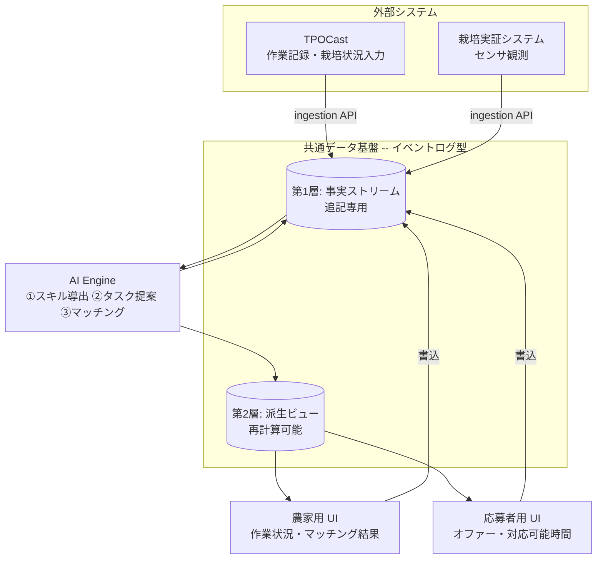
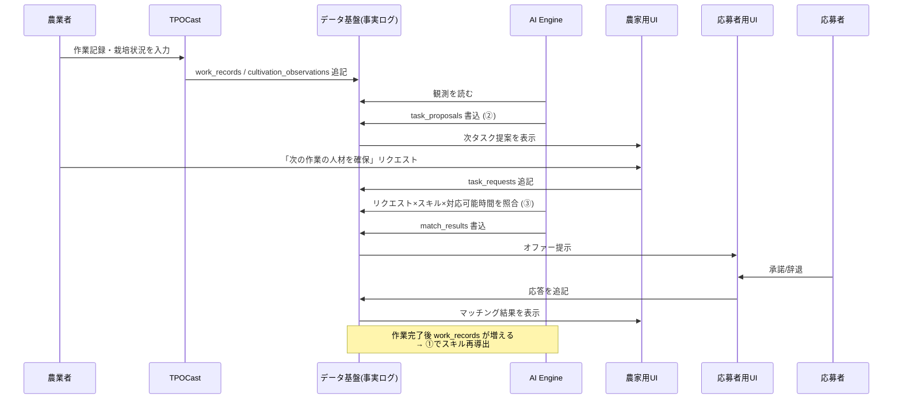

# SODAT R8 アーキテクチャ設計

> 対象: R8 研究開発計画 4.3「労働力の最適化に資するシステムの構築」
> ステータス: ドラフト（議論の起点。確定ではない）

---

## 1. 背景と位置づけ

### 1.1 現行システムと R8 SODAT は別物

本リポジトリ `sodat_control` の現状は **栽培実証システム**（センサ群 + 管理ダッシュボード）である。
R8 計画 4.3 の SODAT は **動的マッチングプラットフォーム**であり、両者は目的が異なる。

| | 現行 `sodat_control` | R8 4.3 で構築する SODAT |
|---|---|---|
| 実体 | 栽培実証システム | 労働力マッチング基盤 |
| Dashboard | センサデータ可視化 | 農家向け：作業状況＋マッチング結果 |
| 中核 | データ収集・アップロード | AI Engine（タスク⇄人材照合） |
| データ | Google Sheets | イベントログ型データ基盤 |

R8 SODAT は現行システムを置き換えるものではなく、**その上に/隣に構築**する。
栽培実証システムは「栽培・育成状況」という観測データの供給源として、TPOCast は「作業記録」の供給源として、それぞれ SODAT に接続される。

### 1.2 システムの主目的

あらかじめ登録された応募者のスキル・実績と、農業現場で短期に分解されたタスクを、
**AI を用いて動的にマッチング**する。これに加えて 2 つの仕組みを持つ:

- **① 実績→スキル自動登録**: TPOCast で作業を登録すると実績として自動蓄積され、習熟度が上がるとスキルとして登録される。
- **② 栽培状況→タスク自動提案**: 栽培・育成状況を登録すると、次に必要なタスクが「タイミング・負荷・必要人数」付きで自動提案される。

---

## 2. 設計原則

### 原則1: イベントログ中核（事実は追記のみ、状態は導出する）

データ基盤は **追記専用のイベントログ**を骨格とする。作業記録・栽培観測・応募・マッチング結果などの
**「起きた事実」は上書き・削除せず追記し続け**、スキルレベルやタスク提案などの状態は事実列から**計算して導出**する。

理由: ①② は両方「事実を溜める → 状態を導く」構造であり、「スキルレベル」や「タスク提案」は
入力値ではなく**事実の関数**である。これを追記ログにすることで、4.3.2 が求める
**マッチング精度の実証評価**（「なぜこの照合になったか」の再現）と**データガバナンス**（監査可能性）が成立する。

### 原則2: 2 種類のタイムスタンプ

すべての事実は 2 つの時刻を持つ:

- `event_time` — その事象が実際に起きた時刻（作業が行われた／観測が行われた時刻）
- `recorded_at` — システムに記録された時刻

`event_time` は対応可能時間の突き合わせ（マッチング）に、`recorded_at` は
「時刻 T の時点でシステムが何を知っていたか」の再現（実証評価）に必要。

### 原則3: 単一の AI Engine（3 つの導出は同じパターン）

①スキル導出・②タスク提案・③マッチングは、すべて
**「イベントログを読む → 計算する → 派生事実を書き戻す」**という同一構造。
別システムに分けず、1 つの AI Engine が 3 つの導出を担う。

### 原則4: API は外部境界のみ、内部は共有データ経由

内部 4 モジュール間を点対点 API で連携させると、連携制御そのものが肥大化する。
内部はすべて共有データ基盤を介して連携し、**モジュール間の直接 API はゼロ**。
API は **TPOCast など外部システムとの境界にのみ**置く（"APIs at the edges, shared data in the core"）。

### 原則5: 統治は単一データ層で

データの所有権・利用範囲・アクセス制御（4.3.2 の成果物）は、単一の統治されたデータ層で定義する。
N 本の点対点フローより、単一データ層のほうが桁違いに統治しやすい。

---

## 3. モジュール構成

4 モジュールはすべて共通データ基盤を介して連携し、互いを直接呼ばない。

| モジュール | 基盤から読む | 基盤へ書く | 他モジュール直接連携 |
|---|---|---|---|
| **TPOCast 連携** | — | `work_records`, `cultivation_observations` | なし（外部 API のみ） |
| **AI Engine** | 事実全般 | `worker_skills`, `task_proposals`, `match_results` | なし |
| **農家用 UI** | `farmer_dashboard_view`, `task_proposals` | `task_requests` | なし |
| **応募者用 UI** | `worker_dashboard_view`, `match_results` | `worker_availability`, 応募応答 | なし |

---

## 4. データ基盤設計

データ基盤は 2 層構造。**第1層（事実）が唯一の真実、第2層（派生）は利便性のための再計算可能なキャッシュ**。

### 4.1 第1層: 事実ストリーム（追記専用）

すべて `event_time` と `recorded_at` を持つ。UPDATE / DELETE しない。以下はスケッチ（確定前）。

| ストリーム | 内容 | 主なカラム（案） |
|---|---|---|
| `work_records` | TPOCast から来る作業実績 | worker_id, task_type, crop, farm_id, quantity, quality, event_time, recorded_at, source |
| `cultivation_observations` | 栽培・育成状況の登録 | farm_id, plot_id, crop, growth_stage, metrics, event_time, recorded_at, source |
| `worker_profile_events` | 資格・免許の登録（入力事実） | worker_id, attribute, value, event_time, recorded_at |
| `worker_availability` | 応募者の対応可能時間 | worker_id, available_from, available_to, area, recorded_at |
| `task_requests` | 農家の人材確保リクエスト | farm_id, task_type, timing_window, estimated_effort, headcount, status, event_time, recorded_at |
| `match_results` | マッチング結果・応答 | request_id, worker_id, score, status(proposed/accepted/declined), event_time, recorded_at |

### 4.2 第2層: 派生ビュー（再計算可能）

第1層から計算して生成。いつでも作り直せる。UI はここを読む。

| ビュー | 由来 | 導出内容 |
|---|---|---|
| `worker_skills` | `work_records` | ① 習熟度を集計し、閾値超過でスキル認定 |
| `worker_qualifications` | `worker_profile_events` | 資格・免許の現在状態（失効判定含む） |
| `task_proposals` | `cultivation_observations` × 標準作業辞書 | ② 次タスク・タイミング・負荷・必要人数 |
| `farmer_dashboard_view` | 複数ストリーム | 農家 UI 用の読み取り面 |
| `worker_dashboard_view` | 複数ストリーム | 応募者 UI 用の読み取り面 |

### 4.3 「真実はログ、便利さは派生」

事実は消さずに残しつつ、UI が読む面は状態共有型のように高速に使う二段構え。
導出ルール（習熟度の閾値など）を変えたら、過去に遡って派生ビューを再計算できる。

---

## 5. AI Engine（3 つの導出）

いずれも「ログを読む → 計算 → 派生事実を書く」の同一パターン。

### ① スキル導出（実績 → スキル）
`work_records` を worker × task_type で集計し、回数・品質・期間から**習熟度**を算出。
閾値を超えたら `worker_skills` にスキルとして認定を書き出す。**認定根拠の作業実績が常に辿れる**。

### ② タスク提案（栽培状況 → タスク）
`cultivation_observations`（栽培・育成状況）を**標準作業辞書**（昨年度成果: 野菜・果樹・お茶の三作目）と
突き合わせ、「次に必要な作業・タイミング・工数・必要人数」を `task_proposals` に書き出す。

### ③ マッチング（タスク × 人材）
`task_requests` を `worker_skills` / `worker_qualifications` / `worker_availability` と照合し、
スコアリングして `match_results` を書き出す。結果は農家・ワーカー双方に提示。

**標準作業辞書**は ② の参照入力であると同時に、4.3.2 の「タスク定義の粒度・妥当性」検証の対象でもある。

---

## 6. エンドツーエンドのデータフロー

---

## 7. 技術スタック（推奨・要確認）

| 層 | 推奨 | 理由 |
|---|---|---|
| データ基盤 | **Supabase（マネージド Postgres）** | 追記ログ + 派生ビューをリレーショナルに扱える。行レベルセキュリティ(RLS)が 4.3.2 のアクセス制御に直結。REST/Realtime API 同梱で UI 接続が容易 |
| UI ホスティング | **Vercel**（現行踏襲） | 既存 `sodat-control.vercel.app` 資産と同一運用 |
| AI Engine | Python（現行 `src/` 資産流用） or Vercel Functions | マッチング・導出ロジック。プロトタイプは薄く |

> **未決**: DB は Supabase / 素の Postgres / 現行 Google Sheets 継続 の選択。
> イベントログ型 + リレーショナル照合という要件上、Google Sheets は中核には力不足。**Supabase を推奨**。

**過剰設計をしない**: Kafka + CQRS + イベントソーシング・フレームワークのような重装備は不要。
Postgres 1 個に「追記専用の事実テーブル群 + マテリアライズドビュー」で十分。

---

## 8. データガバナンス（4.3.2）

作物データ・作業データ・人材データを横断的に扱うため、単一データ層で以下を定義する:

- **所有権**: 作業記録は誰のものか（ワーカー/農家）、栽培データは農家のもの、等
- **利用範囲**: マッチングに使える範囲、統計・評価に使える範囲
- **アクセス制御**: Supabase RLS で「誰がどの事実を読み書きできるか」を一元定義
- **監査・再現性**: 追記ログにより「時刻 T 時点の判定」を完全再現。実証評価の根拠に

---

## 9. 段階的実装計画（案）

まず **薄い縦串（thin vertical slice）を通して**から各層を厚くする。

| Phase | 内容 | 成果 |
|---|---|---|
| **0** | データ基盤スケルトン（Supabase、事実テーブル、2 時刻、ingestion スタブ） | 事実を追記できる |
| **1** | ② タスク提案（栽培観測 → 提案）＋標準作業辞書の取り込み | 栽培実証システムと接続、入力側が動く |
| **2** | ① スキル導出（作業記録 → 習熟度 → スキル） | 実績の蓄積とスキル認定 |
| **3** | ③ マッチングエンジン（リクエスト × スキル × 対応可能時間） | 中核機能が動く |
| **4** | 農家用 UI / 応募者用 UI（派生ビューの上に構築） | エンドツーエンドのデモ |
| 横断 | TPOCast 連携、データガバナンス設計 | 外部接続と統治 |

---

## 10. 未決事項

1. **DB 選定**: Supabase 推奨だが確認要（§7）
2. **TPOCast 連携仕様**: 取り込む作業記録・栽培状況のデータ形式、連携方式（Pull/Push、認証）
3. **標準作業辞書の形式**: 昨年度成果をどのスキーマで取り込むか
4. **習熟度→スキルの閾値ルール**: ① の導出ロジックの具体化
5. **マッチングのスコアリング**: ③ のアルゴリズム（ルールベース → 学習型の段階設計）
6. **独 AgriCrew / Zenjob 現地調査**: 得られた知見をタスク定義・スキル照合・UI 設計へ反映するポイント
